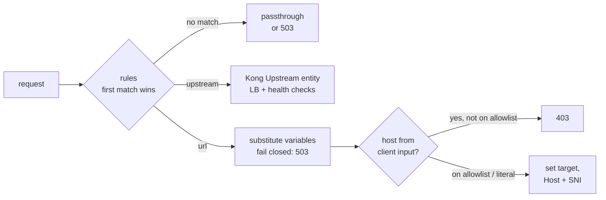

# kong-dynamic-upstream

[](https://github.com/davidgrldo/kong-dynamic-upstream/actions/workflows/test.yml)
[](https://konghq.com/)
[](https://luarocks.org/modules/davidgrldo/kong-dynamic-upstream)
[](LICENSE)

**Route each request to a different upstream, decided at the gateway.**
Gravitee-style dynamic endpoint routing for Kong Gateway OSS 3.x — header,
consumer, and template-based upstream override with SSRF-safe allowlisting.

```yaml
rules:
  - condition:
      header: { name: "X-Tenant", value: "bankxyz" }
    target:
      upstream: bankxyz-cluster                          # Kong Upstream entity
  - condition:
      header: { name: "X-Region" }                       # presence check
    target:
      url: "https://$(header.X-Region).svc.cluster.local:443$(uri)"
      preserve_host: false
```

Rules are evaluated in order (**first match wins**); a rule can point at a
**Kong Upstream entity** (load balancing + health checks) or at a **templated
URL** built from request variables — the same pattern as Gravitee's
`gravitee.attribute.request.endpoint` override, brought to Kong OSS.

## Why

- **Kong OSS has no per-request upstream override.** `route-by-header` is
  Enterprise-only, and request-transformer cannot change the target.
- **Gravitee's dynamic endpoint policy is the closest prior art**, but it has
  no Kong OSS equivalent — and no host allowlisting either.
- **This plugin supports both target modes** (Enterprise `route-by-header`
  only does upstreams; Gravitee only does URLs).



Every behavior claimed here is asserted by tests: **32 unit tests** (plain
Lua 5.1) and a **20-case e2e suite** against real Kong 3.9 (routing,
allowlist 403, port pinning, fail-closed 503, preserve_host, query
handling, TLS/SNI).

## Try it in two minutes

Requires docker and jq:

```sh
git clone https://github.com/davidgrldo/kong-dynamic-upstream
cd kong-dynamic-upstream
KEEP=1 e2e/run.sh            # runs the e2e suite, leaves the stack up

# then play with it:
curl -s localhost:18000/api/hello | jq .os.hostname            # default backend
curl -s -H 'X-Tenant: bankxyz' localhost:18000/api/hello \
  | jq .os.hostname                                            # routed cluster
curl -s -o /dev/null -w '%{http_code}\n' \
  -H 'X-Region: evil.com' localhost:18000/api/hello            # 403, SSRF guard

docker compose -f e2e/docker-compose.yml down -v               # tear down
```

## Installation

```sh
luarocks install kong-dynamic-upstream
# or from a checkout:
#   cd plugins/dynamic-upstream && luarocks make kong-dynamic-upstream-0.2.0-1.rockspec

# then enable it:
export KONG_PLUGINS=bundled,dynamic-upstream
```

## Configuration

```yaml
plugins:
  - name: dynamic-upstream
    config:
      on_no_match: passthrough        # or reject_503
      allowed_hosts:                  # required if any url host is templated
        - "*.internal"
        - "*.svc.cluster.local"
      rules:
        - condition:
            header: { name: "X-Tenant", value: "bankxyz" }
          target:
            upstream: bankxyz-cluster          # Kong Upstream entity
        - condition:
            header: { name: "X-Env", regex: "^sandbox" }
          target:
            url: "https://sandbox-api.internal:8443$(uri)"
            preserve_host: false
        - condition:
            header: { name: "X-Region" }       # presence check
          target:
            url: "https://$(header.X-Region).svc.cluster.local:443$(uri)"
            preserve_host: false
```

| Field | Type | Default | Description |
|-------|------|---------|-------------|
| `rules` | array | *required* | Ordered rules; first match wins. |
| `rules[].condition.header.name` | string | *required* | Header to inspect. |
| `rules[].condition.header.value` | string | *(none)* | Exact match. Mutually exclusive with `regex`. |
| `rules[].condition.header.regex` | string | *(none)* | PCRE match (`ngx.re`, JIT + cache). |
| `rules[].target.upstream` | string | *(none)* | Kong Upstream name. Exactly one of `upstream`/`url`. |
| `rules[].target.url` | string | *(none)* | Literal or templated `http(s)` URL. |
| `rules[].target.preserve_host` | boolean | `true` | `false` rewrites the `Host` header to the target host. `url` targets only; **must be set explicitly for `https` urls** (SNI follows the chosen Host). |
| `allowed_hosts` | array | `[]` | Host allowlist: exact names or `*.suffix`. |
| `on_no_match` | string | `passthrough` | `passthrough` to the route's service, or `reject_503`. |

### Template variables

`$(uri)`, `$(header.NAME)`, `$(query.NAME)`, `$(consumer.username)`,
`$(consumer.custom_id)`. Substitution **fails closed**: an unresolved or empty
variable yields `503`, never an empty string spliced into the URL.

This is deliberately *not* a full expression language — five variables cover
the routing use cases without the attack surface of an evaluator.

### Path, query and Host semantics

- A path in the target URL replaces the upstream path; use `$(uri)` to
  forward the client path.
- A query string in the target URL **replaces** the client's query string;
  without one, the client's query passes through untouched.
- Fragments (`#`) are rejected.
- `preserve_host: true` (default) keeps the client's `Host` header;
  `false` rewrites it to the target host, with `:port` appended when the
  port is not the scheme default. It applies to `url` targets only — the
  schema rejects it on `upstream` targets.

### TLS and SNI

Kong derives the upstream SNI from the upstream `Host` header
(`proxy_ssl_name $upstream_host`), so for `https` targets SNI follows
whichever host `preserve_host` selects: the target host when `false`, the
client host when `true` — verified in the e2e suite. **For `https` targets
you almost always want `preserve_host: false`**: with `true`, the upstream
handshake carries the *client's* SNI, which the target's certificate
usually doesn't cover. That's why the schema refuses an `https` url
without an explicit `preserve_host` — the foot-gun can't be configured by
accident. Upstream certificate verification is not plugin config; it
follows the Service entity (`tls_verify`, `ca_certificates`), and the
verified name is the same `$upstream_host`, so verification composes with
dynamic targets.

## Security: the SSRF guard

A templated host means a client header can decide where Kong connects. Without
a boundary, `X-Region: 169.254.169.254` walks straight into your metadata
service. Two layers prevent that:

1. **Config time** — the schema rejects any `target.url` whose *host portion*
   contains a variable unless `allowed_hosts` is non-empty **and** the
   template pins a literal `:port` — so a header value can never choose the
   port on an allowlisted host (no internal port-scanning through the
   gateway). (`$(uri)` and variables after the first `/` are path-only and
   don't trigger this.)
2. **Request time** — after substitution, the resolved host must match the
   allowlist or the request gets `403`. Resolved URLs are also re-parsed and
   validated (scheme, no userinfo, no fragments, hostname charset), so header
   values cannot smuggle ports, paths, or a second host — an injected
   `host:9090` fails the hostname charset check with `503`.

Literal hosts written in config are operator-controlled and trusted as-is.

## Plugin ordering

`PRIORITY = 750`: runs after authentication plugins (so `$(consumer.*)` is
populated) and after `request-transformer` (801), so header rewrites settle
before rules are evaluated.

## Roadmap

- [ ] Condition types beyond header: `query`, `consumer` (username/group)
- [ ] Weighted targets per rule (canary-lite)
- [ ] `KongPlugin` CRD examples for Kong Ingress Controller

## Development

```sh
# unit tests (plain Lua 5.1+, kong/ngx are mocked)
LUA_PATH="./?.lua;./plugins/dynamic-upstream/?.lua;;" lua spec/run.lua

# e2e (docker + jq): Kong 3.9 DB-less + echo upstreams
e2e/run.sh              # KEEP=1 e2e/run.sh leaves the stack running
```

`config/kong.yml` is a runnable DB-less example exercising both target modes.
Both test suites run in CI on every push.

## License

[Apache-2.0](LICENSE).
